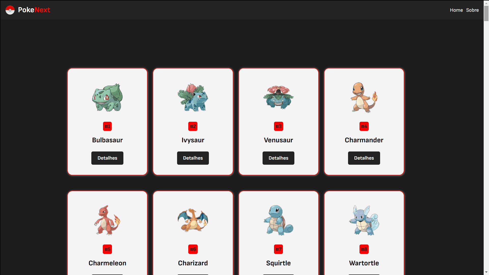

<h1 align="center">PokeNext</h1>

<p align="center">Pokedex utilizando Next.js</p><br>
<h3 align="center"><a href="https://pokenext-mien.vercel.app/" target="_blank"><strong>[ USE AGORA ]</strong></a></h3>

---

<br>

<div align="center">
  
</div>

## 💻 Projeto

O pokenext é uma pokedex desenvolvida em React você pode visualizar alguns pokemon e suas informações.

## 🚀 Tecnologias

As seguintes ferramentas foram usadas na construção do projeto:

- [NextJS]
- [ReactJs]
- [Javascript]
- [HTML]
- [CSS]

## Getting Started

First, run the development server:

```bash
npm run dev
# or
yarn dev
# or
pnpm dev
```

Made with 💟 by Damien Costa ✌🏿

<a href="https://www.linkedin.com/in/damien-costa/" target="_blank">
